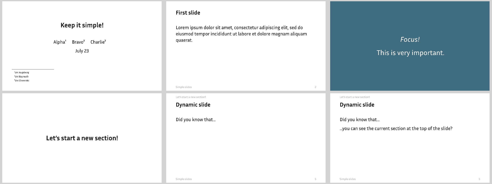

# Simple theme



This theme is rather unobstrusive and might still be considered bare-bones.
It uses a minimal amount of colour and lets you define your slides' content very
freely.

Use it via
```typ
{{#include ../../IMPORT.typ}}
#import themes.simple: *

#show: simple-theme.with(...)
```

`simple` uses regular headings for sections.
Unless specified otherwise, first level headings create new sections.
The regular `#outline` is configured such that it lists the names of all sections.

Second level headings are supposed to be used as slide titles and introduce some
spacing below them.

Text is configured to have a base font size of 25 pt.

## Options for initialisation
`simple-theme` accepts the following optional keyword arguments:

- `aspect-ratio`: the aspect ratio of the slides, either `"16-9"` or `"4-3"`,
  default is `"16-9"`
- `footer`: text to display in the footer of every slide, default is `[]`
- `background`: background colour, default is `white`
- `foreground`: text colour, default is `black`

## Slide functions
`simple` provides the following custom slide functions:

```typ
#centered-slide[
  ...
]
```
A slide where the content is positioned in the center of the slide.
Not suitable for content that exceeds one page.

---

```typ
#title-slide[
  ...
]
```
Same as `centered-slide` but makes heading of level 1 not outlined, so that the
presentation title does not show up in the outline.
Not suitable for content that exceeds one page.

---

```typ
#slide[
  ...
]
```
Decorates the provided content with a header containing the current section (if
any) and a footer containing some custom text and the slide number.

---

```typ
#focus-slide(foreground: ..., background: ...)[
  ...
]
```
Draw attention with this variant where the content is displayed centered and text
is enlarged.
Optionally accepts a foreground colour (default: `white`) and background color
(default: `aqua.darken(50%)`).
Not suitable for content that exceeds one page.


## Example code
The image at the top is created by the following code:
```typ
{{#include ../../IMPORT.typ}}
{{#include simple.typ:3:}}
```
