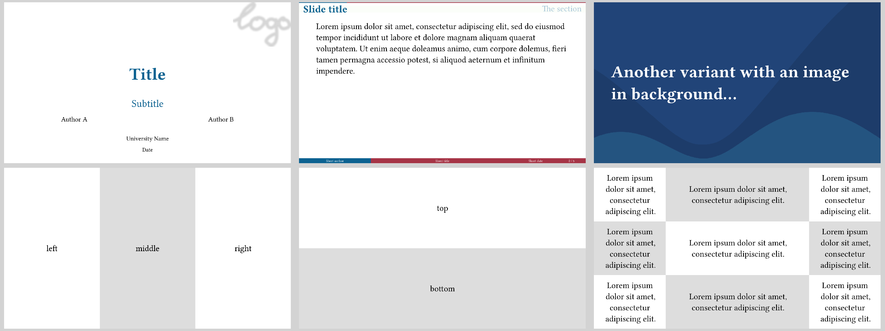

# University theme



This theme offers a simple yet versatile design, allowing for easy customization
and flexibility. Additionally, it incorporates a progress bar at the top, which
displays the current status of the presentation.
`university` also makes working with mulit-column content very easy.

Use it via
```typ
#import "@preview/polylux:0.2.0": *
#import themes.university: *

#show university-theme.with(...)
```

`university` uses polylux' section handling, the regular `#outline()` will not work
properly, use `#polylux-outline` instead.
Starting a new section is done by the corresponding keyword argument of `#slide`.

Text is configured to have a base font size of 25 pt.

## Options for initialisation
`university-theme` accepts the following optional keyword arguments:

- `aspect-ratio`: the aspect ratio of the slides, either `"16-9"` or `"4-3"`,
  default is `"16-9"`
- `short-title`: short title of the presentation to display on every slide,
  default: `none`
- `short-author`: short author of the presentation to display on every slide,
  default: `none`
- `short-date`: short date of presentation to display on every slide, default:
  `none`
- `color-a`: main colour of decorations, default: `rgb("#0C6291")`
- `color-b`: accent colour, default: `rgb("#A63446")`
- `color-c`: second accent colour, default: `rgb("#FBFEF9")`
- `progress-bar`: boolean value whether or not to display a progress bar on
  regular sides, default: `true`

## Slide functions
`metropolis` provides the following custom slide functions:

```typ
#title-slide(...)
```
Creates a title slide where title and subtitle are separated by additional
information by a bright line.
Accepts the following keyword arguments:
- `title`: title of the presentation, default: `[]`
- `subtitle`: subtitle of the presentation, default: `none`
- `authors`: authors of presentation, can be an array of contents or a single
  content, will be displayed in a grid, default: `()`
- `date`: date of the presentation, default: `none`
- `institution-name`: name of the institution, default: `"University"`
- `logo`: some content (most likely an image) used as a logo on the title slide,
  default: `none`

Does not accept additional content.

---

```typ
#slide(...)[
  ...
][
  ...
]
```
Decorates the provided content with a header containing a progress bar (optionally),
the slide title, and the current section (if any); and a footer containing short
forms of authors, title, and date, and the slide number.
Header and footer can also be overwritten by respective keyword arguments.

Accepts an arbitrary amount of content blocks, they are placed next to each other
as columns.
Configure using the `columns` and `gutter` keyword arguments. 

Pass the slide title as a keyword argument `title`.

Accepts the following keyword arguments:
- `title`: title of the slide, default: `none`,
- `columns`: propagated to `grid` for placing the body columns, default: array
  filled with as many `1fr` as there are content blocks
- `gutter`: propagated to `grid` for placing the body columns, default: `1em`
- `header`: custom content to overwrite default header
- `footer`: custom content to overwrite default footer
- `new-section`: name of the new section that starts here if not `none`, default:
  `none`

---

```typ
#focus-slide(background-img: ..., background-color: ...)[
  ...
]
```
Draw attention with this variant where the content is displayed centered and text
is enlarged and bright.
You can either specify a background image or a background colour as keyword
arguments.
If you specify none of them, a background colour of `rgb("#0C6291")` is used as
a default.

Not suitable for content that exceeds one page.

---

```typ
#matrix-slide(columns: ..., rows: ...)[
  ...
][
  ...
]
```
Create a slide where the provided content blocks are displayed in a grid and
coloured in a checkerboard pattern without further decoration.
You can configure the grid using the `rows` and `columns` keyword arguments
(both default to `none`).
It is determined in the following way:
1. If `colmuns` is an integer, create that many columns of width `1fr`.
2. If `columns` is `none`, create as many columns of width `1fr` as there are
  content blocks.
3. Otherwise assume that `columns` is an array of widths already, use that.
4. If `rows` is an integer, create that many rows of height `1fr`.
5. If `rows` is `none` create that many rows of height `1fr` as are needed
  given the number of content blocks and columns.
6. Otherwise assume that `rows` is an array of heights already, use that.
7. Check that there are enough rows and columns to fit in all the content blocks.

That means that `#matrix-slide[...][...]` stacks horizontally and
`#matrix-slide(columns: 1)[...][...]` stacks vertically.

Not suitable for content that exceeds one page.


## Example code
The image at the top is created by the following code:
```typ
#import "@preview/polylux:0.2.0": *
{{#include university.typ:3:}}
```
